# Vessel Web Center
That's my final project based on SoftUni ASP.NET CORE Web course requirements.

# Description & Project Introduction 
The Project follows the best practices for Object Oriented design and high-quality code for the Web application.
Application is designed for education only and any coincidence of names, mathematical measurements or anything in connection
with the real world objects shall be deemed as formal and not on purpose.
This project shows small amount of the following:
- Choose your favourite Vessels and make a voyage around the globe.
- Get the Vessels from their starting position to another ( limited positions at this time) , by getting very close and sharp mathematical
calculations.Thus you have idea of what distance and how much time will the voyage take to be done.
- All Vessels have their own Crew and capability of collecting or removing such.
- The limits are imposed of minimum 15 Crew members and maximum 25 in order to get any Vessel on her intended voyage.
- There are statistics of the current Port congestion and traffic of vessels inside the Port and the Top 10 of it.
- There are statistics of the most visited Ports by Vessels, as that can be easily changed dynamically by doing voyages with your favourite vessels.
- A Crew member can be Add to or removed from any vessel, as well as saving it in database for late assignment.
- Destinations are also  limited and pure distance can be obtained between two different ports.
- Application keeps track of the distances of any vessel and also the total distance sailed by all vessels part of a given company.

# Built using the following:
- ASP.NET Core 6 MVC
- Areas
- Repository
- MSSQL Server
- Entity Framework Core
- AJAX
- jQuery
- Moq
- NUnit tests
- Bootstrap
- Java Script
- DataTables
- High Charts - Diagram Implementation
- Toast messages
- Dependency Injection

# Getting started...
* You can register a User. By default Admin User is seeded at application start.You are given full control
and permission of this Application users,roles and actions.You got redirected to Administration area at first.After logout you have
opportunity to register as much users as you want.Once you do this you are free to manage all users roles in when you access your
administration profile.
* Default credentials for admin:
<> Email: admin@abv.bg
<> Password: admin@admin
* Most of the Entities are seeded and one of the Vessels already have a Crew capable of doing their first international Voyage!
* If you want more vessels enabled for sailing you have to hire more crew members on board of these vessels.
* All subsequent users registered need to be given a role or they will be without such.
* The following roles can be used : Administrator, User-Owner and Ordinary-User.There is a menu where this can be done.(In Admin area, logged as Admin)
* Only first 2 roles can have the big interaction and test the full application potential.The third one can only observe partial
information and can not be part of the big deal:)
* You can set your favourite vessel to sail to her intended destination and observe the sailed distances, as well as the total distance
covered by the relevant company vessels. You can compare all vessels by their distances and many more statistics.
* There is a menu where you can get information(statistics) about crew available/unavailable , most visited ports in a table or structured 
in a graphic by means of using High Charts implementation.Further more you can see all companies and their vessels with their achieved distances.
* Not logged-in users have almost no point of using this application ( don't be one of them) :)

# Project Architecture
- My main project consists of 4 projects strictly connected and depending each other.
1. VesselWebCenter - ASP .NET Core Web App MVC.
2. VesselWebCenter.Data - Class Library, holding DBContext, Migrations and DB-Models.
3. VesselWebCenter.Services - Class Library, holding Services and Service Models and main business logic of the application.
4. VesselWebCenter.Tests - NUnit Test Project, holding Service Tests, proving that the application works as expected.

# Gallery 
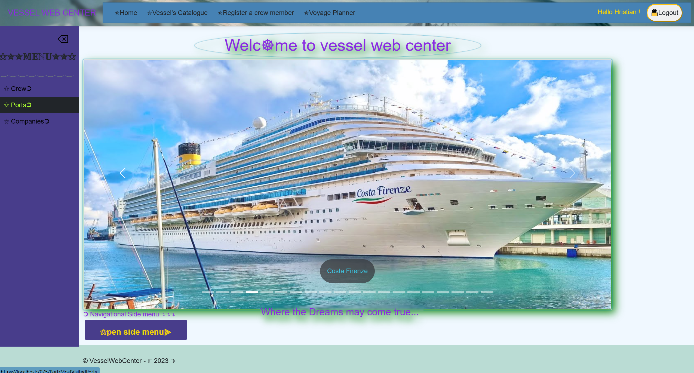
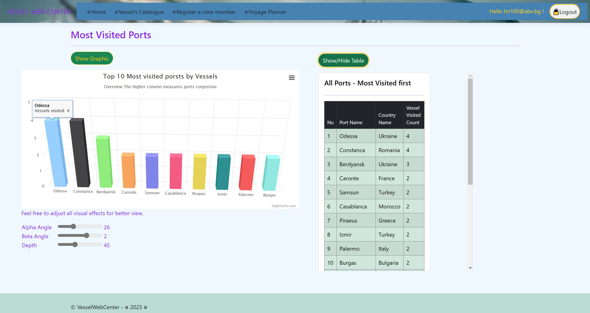
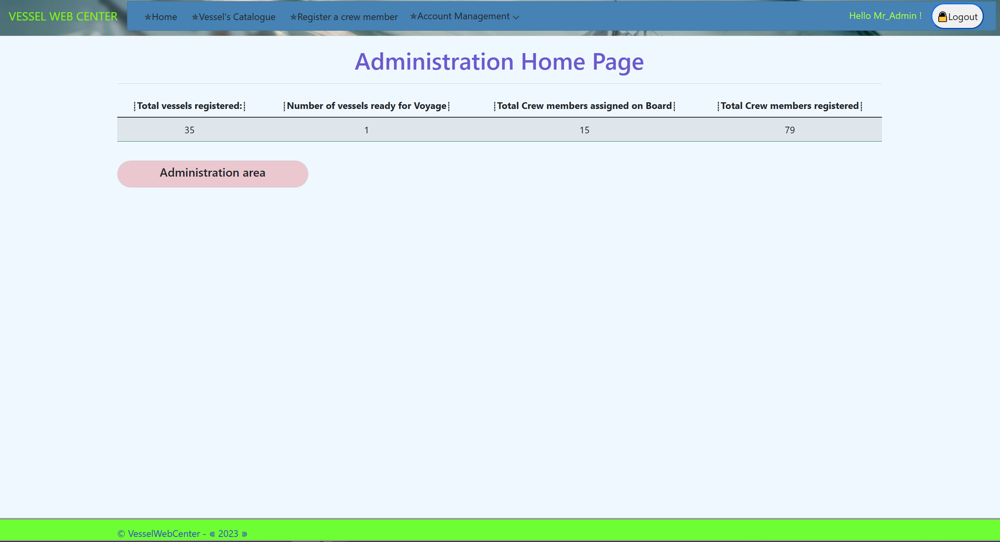
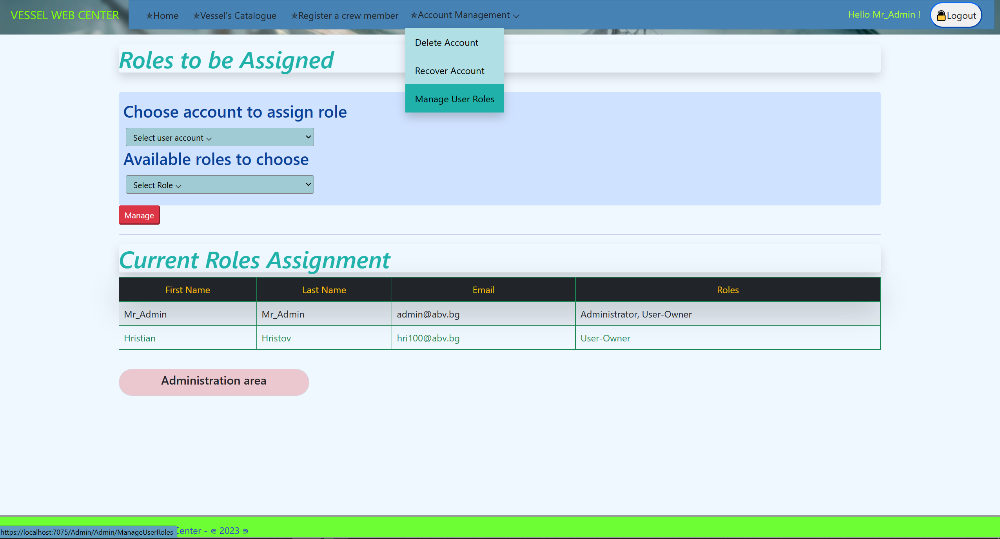
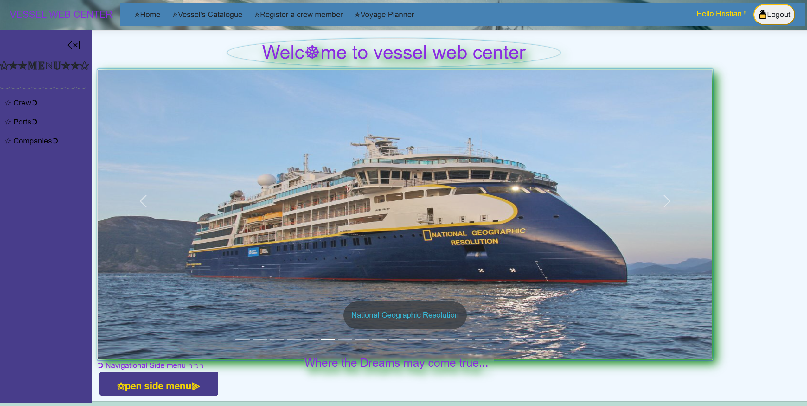
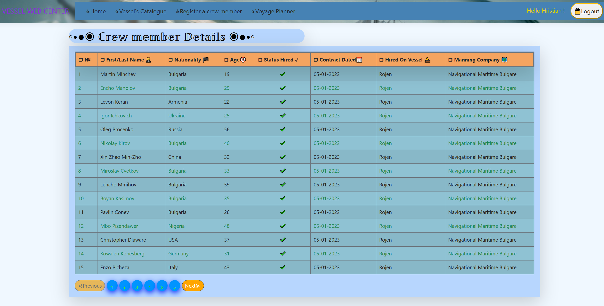
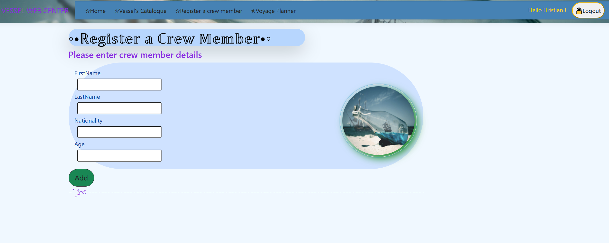
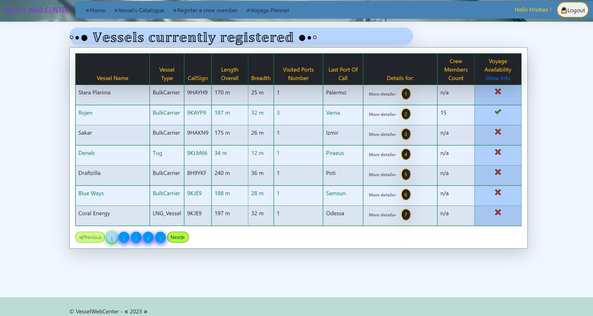
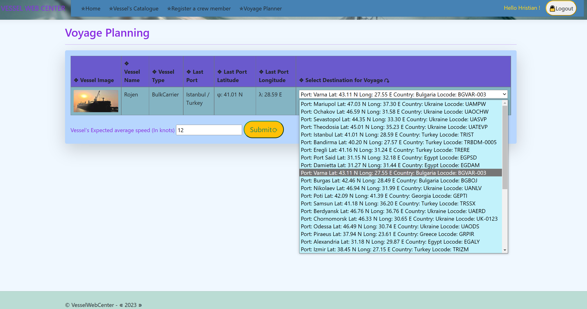
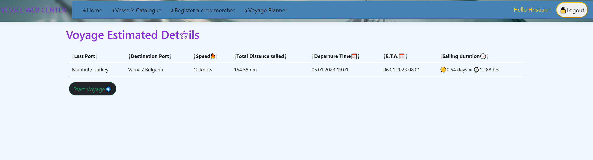
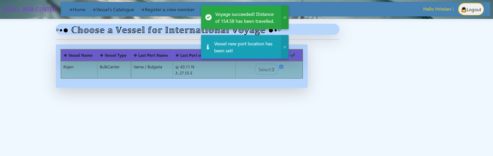

# Data Base Diagram
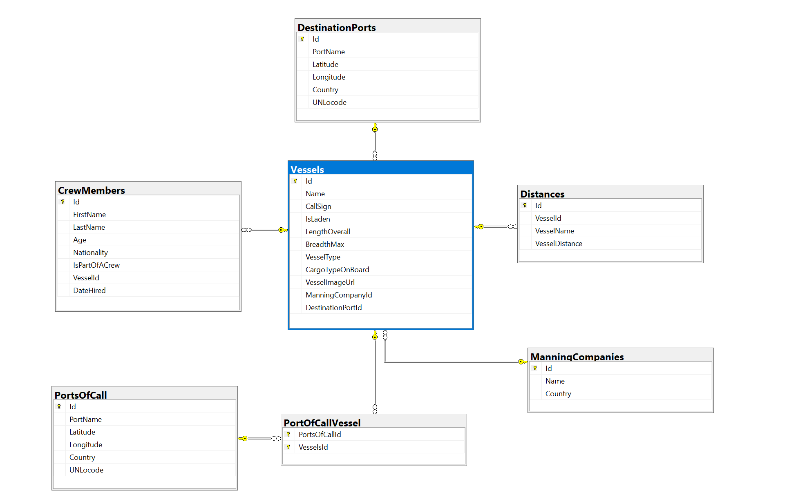

